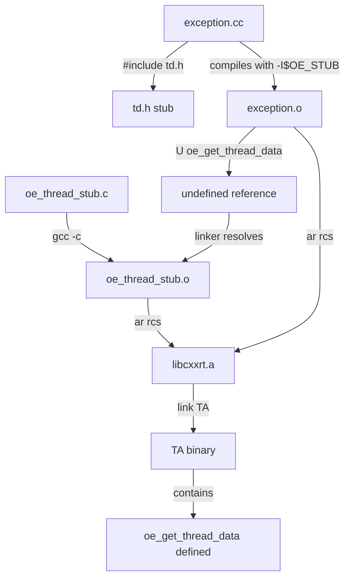

# OpenEnclave Stub Usage Documentation

## 📁 File Structure

```
build_oe_libs/openenclave_stub/
├── oe_thread_stub.c              # Implementation (compile to .o)
├── oe_thread_stub.o              # Compiled object (gộp vào libcxxrt.a)
└── openenclave/
    └── internal/
        └── sgx/
            └── td.h              # Header stub (replace Intel SGX version)
```

---

## 🎯 Purpose: Replace Intel SGX with OP-TEE Stub

### Problem
OpenEnclave's libcxxrt uses Intel SGX-specific thread-local storage:
```c
// OpenEnclave real implementation (SGX x86_64 only)
oe_thread_data_t* oe_get_thread_data() {
    void* fsbase;
    asm("mov %%fs:0, %0" : "=r"(fsbase));  // ❌ ARM64 doesn't have FS register
    return (oe_thread_data_t*)fsbase;
}
```

### Solution
Our stub provides simple global storage for single-threaded OP-TEE:
```c
// Our stub (works on ARM64)
oe_thread_data_t __optee_global_thread_data = {NULL, NULL};

oe_thread_data_t* oe_get_thread_data(void) {
    return &__optee_global_thread_data;  // ✅ Simple global variable
}
```

---

## 📋 Where Are These Files Used?

### 1. **td.h** - Header Stub

#### Used By:
- **exception.cc** (libcxxrt source)
  ```cpp
  // external/openenclave/3rdparty/libcxxrt/libcxxrt/src/exception.cc:39
  #include <openenclave/internal/sgx/td.h>
  
  static __cxa_thread_info *thread_info() {
      oe_thread_data_t* td = oe_get_thread_data();  // ← Calls our stub!
      return (__cxa_thread_info*) td->__cxx_thread_info;
  }
  ```

#### Build Scripts Using It:
1. **build_libcxxrt_complete.sh**
   ```bash
   Line 9: OE_STUB=build_oe_libs/openenclave_stub
   Line 30: -I$OE_STUB  # Add to include path
   ```
   - Compiles exception.cc with `-I$OE_STUB`
   - Compiler finds `openenclave/internal/sgx/td.h` in our stub directory
   - Uses our stub instead of real SGX version

2. **build_libunwind_openenclave.sh**
   ```bash
   Line 9: OE_STUB=build_oe_libs/openenclave_stub
   ```
   - Also includes stub path for consistency

#### Why Not Use Real OpenEnclave Header?
Real header declares:
```c
oe_thread_data_t* oe_get_thread_data(void);  // Declaration only
```

But implementation is in:
```c
// external/openenclave/enclave/core/sgx/td.c
oe_thread_data_t* oe_get_thread_data() {
    oe_sgx_td_t* td = oe_sgx_get_td();     // ← Calls SGX-specific code
    return &(td->base);
}

static oe_sgx_td_t* _sgx_get_td(bool check_fs) {
    void* fsbase;
    asm("mov %%fs:0, %0" : "=r"(fsbase)); // ❌ x86_64 only!
    // ...
}
```

**Cannot compile on ARM64!** Need our stub.

---

### 2. **oe_thread_stub.c** - Implementation

#### When Compiled:
```bash
# Manually compiled and added to libcxxrt.a (NOT in build script yet)
cd build_oe_libs/openenclave_stub
aarch64-none-linux-gnu-gcc -c oe_thread_stub.c -o oe_thread_stub.o \
    -I. -I../musl/include -nostdinc -ffreestanding -fPIC
```

#### Current State:
- ✅ File exists: `build_oe_libs/openenclave_stub/oe_thread_stub.c`
- ✅ Compiled to: `build_oe_libs/openenclave_stub/oe_thread_stub.o`
- ✅ Added to: `build_oe_libs/libcxxrt/libcxxrt.a`

#### How It's Added to libcxxrt.a:
```bash
# Manually run (should be in build script):
cd build_oe_libs/libcxxrt
aarch64-none-linux-gnu-ar rcs libcxxrt.a ../openenclave_stub/oe_thread_stub.o
aarch64-none-linux-gnu-ranlib libcxxrt.a
```

#### Verify:
```bash
$ aarch64-none-linux-gnu-ar t build_oe_libs/libcxxrt/libcxxrt.a
stdexcept.o
typeinfo.o
guard.o
dynamic_cast.o
memory.o
auxhelper.o
libelftc_dem_gnu3.o
exception.o
oe_thread_stub.o          # ← Our stub is here!
```

---

### 3. **oe_thread_stub.o** - Compiled Object

#### Gộp Vào Đâu:
**libcxxrt.a** (build_oe_libs/libcxxrt/libcxxrt.a)

#### Why in libcxxrt.a?
1. **exception.o needs it**
   ```bash
   $ aarch64-none-linux-gnu-nm exception.o | grep oe_get
                    U oe_get_thread_data  # ← Undefined reference
   ```

2. **Linker pulls it from archive**
   - When linking TA, exception.o has undefined `oe_get_thread_data`
   - Linker searches libcxxrt.a
   - Finds oe_thread_stub.o with defined symbol
   - Links it into final TA binary

3. **Verify in TA**
   ```bash
   $ aarch64-none-linux-gnu-nm ta/*.elf | grep oe_get
   0000000000057678 T oe_get_thread_data          # ← Defined in TA!
   00000000000a30d8 B __optee_global_thread_data  # ← Global variable!
   ```

---

## 🔄 Build Flow



### Step by Step:

1. **Header Stub (Compile Time)**
   ```bash
   # build_libcxxrt_complete.sh line 30
   -I$OE_STUB  # Compiler finds openenclave/internal/sgx/td.h
   ```
   - exception.cc includes our td.h stub
   - Compiles to exception.o with `U oe_get_thread_data` (undefined)

2. **Implementation Stub (Manual - Should Be Automated)**
   ```bash
   gcc -c oe_thread_stub.c -o oe_thread_stub.o
   ar rcs libcxxrt.a oe_thread_stub.o
   ```
   - Compiles stub implementation
   - Adds to libcxxrt.a archive

3. **Linking (TA Makefile)**
   ```makefile
   # ta/Makefile line 67
   $(LDta_arm64) ... $(LIBCXXRT) ... -o $@
   ```
   - Links libcxxrt.a into TA
   - Linker sees undefined `oe_get_thread_data` in exception.o
   - Searches libcxxrt.a and finds oe_thread_stub.o
   - Pulls in and links the stub

---

## ⚠️ Important Notes

### 1. Stub is NOT in build_openenclave_libs.sh
```bash
# build_openenclave_libs.sh
# ❌ Does NOT build libcxxrt
# ✅ Only builds: musl headers, libcxx objects
```
**Why?** libcxxrt is built separately by `build_libcxxrt_complete.sh`

### 2. Stub Must Be Manually Added (For Now)
Current process:
1. Run `build_libcxxrt_complete.sh` → builds exception.o (with undefined oe_get_thread_data)
2. Manually compile oe_thread_stub.c → oe_thread_stub.o
3. Manually add to libcxxrt.a: `ar rcs libcxxrt.a oe_thread_stub.o`

**TODO**: Automate step 2-3 in build_libcxxrt_complete.sh!

### 3. Why Not Build Separately?
Could create `liboestub.a`:
```bash
ar rcs liboestub.a oe_thread_stub.o
# Link: $(LIBCXXRT) $(LIBOESTUB)
```

But **better to include in libcxxrt.a** because:
- ✅ exception.o is already in libcxxrt.a
- ✅ Keeps related code together
- ✅ One less library to manage
- ✅ Linker automatically pulls in when needed

---

## 🔧 How to Automate

Add to end of `build_libcxxrt_complete.sh`:

```bash
# Add after line 154

echo ""
echo "===== Building OpenEnclave Thread Stub ====="

STUB_SRC="$OE_STUB/oe_thread_stub.c"
STUB_OBJ="$OE_STUB/oe_thread_stub.o"

if [ -f "$STUB_SRC" ]; then
    echo -n "Building oe_thread_stub.o... "
    if ${CROSS_COMPILE}gcc \
        -c "$STUB_SRC" -o "$STUB_OBJ" \
        -I"$OE_STUB" \
        -I"$MUSL_INC" \
        -nostdinc -ffreestanding -fPIC \
        2>&1 | tee "$STUB_OBJ.log"; then
        echo "OK"
        
        echo "Adding to libcxxrt.a..."
        ${CROSS_COMPILE}ar rcs "$OUTPUT_LIB" "$STUB_OBJ"
        ${CROSS_COMPILE}ranlib "$OUTPUT_LIB"
        
        echo "✓ Thread stub added to libcxxrt.a"
    else
        echo "FAIL"
        echo "Check log: $STUB_OBJ.log"
    fi
else
    echo "⚠ Warning: $STUB_SRC not found"
fi
```

---

## 📊 Summary Table

| File | Purpose | Used By | Compiled | Linked Into |
|------|---------|---------|----------|-------------|
| `td.h` | Header stub | exception.cc | No (header only) | N/A |
| `oe_thread_stub.c` | Implementation | N/A | Yes → .o | libcxxrt.a |
| `oe_thread_stub.o` | Compiled stub | Linker | N/A | libcxxrt.a |
| `libcxxrt.a` | Final library | TA Makefile | N/A | TA binary |

---

## ✅ Verification Commands

### Check stub in libcxxrt.a:
```bash
aarch64-none-linux-gnu-ar t build_oe_libs/libcxxrt/libcxxrt.a | grep stub
# Output: oe_thread_stub.o
```

### Check symbols in stub:
```bash
aarch64-none-linux-gnu-nm build_oe_libs/openenclave_stub/oe_thread_stub.o
# Output:
# 0000000000000000 T oe_get_thread_data
# 0000000000000000 B __optee_global_thread_data
```

### Check exception.o needs stub:
```bash
aarch64-none-linux-gnu-nm build_oe_libs/libcxxrt/exception.o | grep oe_get
# Output:
#                  U oe_get_thread_data  (Undefined - needs stub!)
```

### Check TA has stub linked:
```bash
aarch64-none-linux-gnu-nm ta/*.elf | grep -E "oe_get_thread_data|__optee_global_thread_data"
# Output:
# 0000000000057678 T oe_get_thread_data
# 00000000000a30d8 B __optee_global_thread_data
```

---

## 🎯 Key Takeaways

1. **td.h** replaces Intel SGX header at compile time (`-I$OE_STUB`)
2. **oe_thread_stub.c** provides ARM64-compatible implementation
3. **oe_thread_stub.o** is **gộp vào libcxxrt.a** (not separate library)
4. Linker automatically pulls stub when exception.o needs it
5. Currently manual process - should be automated in build script

---

## 🐛 Debugging Exception Crash

If exception test still fails, check:

1. **Stub is in libcxxrt.a?**
   ```bash
   ar t build_oe_libs/libcxxrt/libcxxrt.a | grep stub
   ```

2. **Stub symbols in TA?**
   ```bash
   nm ta/*.elf | grep oe_get_thread_data
   ```

3. **Global data initialized?**
   ```c
   // Should be {NULL, NULL} initially
   oe_thread_data_t __optee_global_thread_data = {NULL, NULL};
   ```

4. **libcxxrt sets __cxx_thread_info on first use**
   - First exception allocates thread-local storage
   - Stores in __optee_global_thread_data.__cxx_thread_info
   - Single-threaded OP-TEE doesn't need real TLS

---

**Generated**: December 17, 2025
